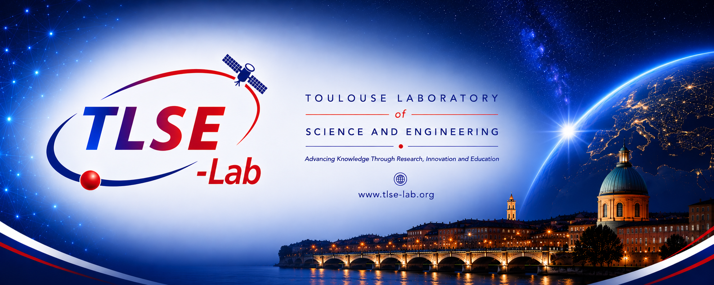

  

# Toulouse Laboratory of Science and Engineering

## TLSE-Lab

**Independent Research Institute**

📍 **Toulouse, France** · 🌍 **International Collaboration**

---
## Welcome

**TLSE-Lab (Toulouse Laboratory of Science and Engineering)** is an independent multidisciplinary research institute committed to advancing science and engineering for the benefit of society.

Our mission is to generate new knowledge, create innovative technologies, pursue scientific excellence, and foster the transfer of scientific discoveries through education, collaboration and the open dissemination of research outcomes.
---

## Research Areas

- 🧠 Artificial Intelligence
- 📊 Data Science
- 💻 Software Engineering
- 📐 Applied Mathematics
- 🤖 Robotics and Intelligent Systems
- 🛰️ Space Technologies
- ⚡ Renewable Energy Systems
- 🏥 Digital Health and Biomedical Engineering
- 🌐 Computer Networks and Cybersecurity
- 📚 Digital Education Technologies

---

## Our Mission

TLSE-Lab aims to:

- Advance scientific knowledge through fundamental and applied research.
- Design innovative engineering solutions addressing societal and industrial challenges.
- Promote interdisciplinary collaboration across scientific domains.
- Support higher education through teaching, mentoring and scientific dissemination.
- Foster partnerships with universities, research institutes, industry and international organizations.

---

## Collaboration

We welcome collaborations with:

- 🎓 Universities
- 🔬 Research Institutes
- 🏭 Industry
- 🏛️ Government Agencies
- 🌍 International Organizations

---

## Featured Projects

- Artificial Intelligence
- Data Science
- Research Software
- Scientific Computing
- Engineering Innovation
- Open Educational Resources

---

## Website

🌐 https://tlse-lab.org

---

## Contact

📧 bachelin@gmail.com

---

**Advancing Knowledge Through Research, Innovation and Education**

